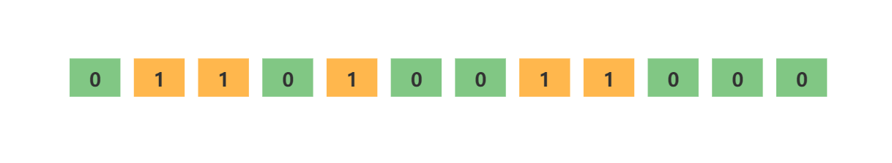
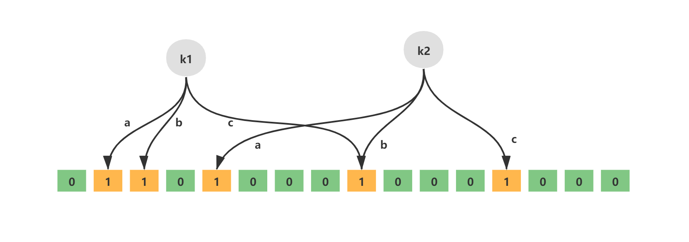

# 布隆过滤器
## 1. 布隆过滤器简介
布隆过滤器（Bloom Filter）是1970年由布隆提出的。它实际上是一个很长的二进制向量和一系列随机映射函数。布隆过滤器可以用于检索一个元素是否在一个集合中。它的优点是空间效率和查询时间都比一般的算法要好的多，缺点是有一定的误识别率和删除困难。

上面这句介绍比较全面的描述了什么是布隆过滤器，如果还是不太好理解的话，就可以把布隆过滤器理解为一个set集合，我们可以通过add往里面添加元素，通过contains来判断是否包含某个元素。由于本文讲述布隆过滤器时会结合Redis来讲解，因此类比为Redis中的Set数据结构会比较好理解，而且Redis中的布隆过滤器使用的指令与Set集合非常类似（后续会讲到）。

**布隆过滤器的优点：**
* 时间复杂度低，增加和查询元素的时间复杂为O(N)，（N为哈希函数的个数，通常情况比较小）；
* 保密性强，布隆过滤器不存储元素本身；
* 存储空间小，如果允许存在一定的误判，布隆过滤器是非常节省空间的（相比其他数据结构如Set集合）。

**布隆过滤器的缺点：**
* 有点一定的误判率，但是可以通过调整参数来降低；
* 无法获取元素本身；
* 很难删除元素。

## 2. 布隆过滤器原理
### 2.1 数据结构
布隆过滤器它实际上是一个很长的**二进制向量和一系列随机映射函数**。以Redis中的布隆过滤器实现为例，Redis中的布隆过滤器底层是一个大型位数组（二进制数组）+多个无偏hash函数。

**一个大型位数组（二进制数组）：**


**多个无偏hash函数：**
无偏hash函数就是能把元素的hash值计算的比较均匀的hash函数，能使得计算后的元素下标比较均匀的映射到位数组中。
如下就是一个简单的布隆过滤器示意图，其中k1、k2代表增加的元素，a、b、c即为无偏hash函数，最下层则为二进制数组。


### 2.2 空间计算
在布隆过滤器增加元素之前，首先需要初始化布隆过滤器的空间，也就是上面说的二进制数组，除此之外还需要计算无偏hash函数的个数。布隆过滤器提供了两个参数，分别是预计加入元素的大小n，运行的错误率f。布隆过滤器中有算法根据这两个参数会计算出二进制数组的大小l，以及无偏hash函数的个数k。它们之间的关系比较简单：
* 错误率越低，位数组越长，控件占用较大
* 错误率越低，无偏hash函数越多，计算耗时较长

## 3. 布隆过滤器的使用场景
布隆过滤器可以告诉我们 “某样东西一定不存在或者可能存在”，也就是说布隆过滤器说这个数不存在则一定不存，布隆过滤器说这个数存在可能不存在（误判，后续会讲），利用这个判断是否存在的特点可以做很多有趣的事情。
1. 解决Redis缓存穿透问题（面试重点）
2. 邮件过滤，使用布隆过滤器来做邮件黑名单过滤
3. 对爬虫网址进行过滤，爬过的不再爬
4. 解决新闻推荐过的不再推荐(类似抖音刷过的往下滑动不再刷到)
5. HBase\RocksDB\LevelDB等数据库内置布隆过滤器，用于判断数据是否存在，可以减少数据库的IO请求
---
# Java集合框架
## 1. Stream
### 1.1 Stream种类
1. **并行流**：Stream#parallel();
2. **无序流**：Stream#unordered();
3. **顺序流**：Stream#sequential();

### 1.2 Stream常用操作
**中间操作**
  -  limit();
  -  skip();
  -  distinct();
  -  map();
  -  flatMap();
  -  filter();
  -  sort();
  -  peek();

**终结操作**
  - max();
  - min();
  - foreach();
  - count();
  - collect();
  - reduce();
  - findFirst();
  - findAny();
  - anyMatch();
  - allMatch();
  - noneMatch();

**获取流**
  1. Collection#stream();
  2. Arrays.stream();

**常用下游收集器**
|方法名|描述|
|-|-|
|mapping(x -> y，dc) |将x转换为y，用下游收集器dc收集|
|flatMapping(x -> substream, dc)|将x转换为substream，用下游收集器dc收集|
|filtering(x -> boolean, dc)|过滤后，用下游收集器dc收集|
|counting()|求个数|
|mingBy((a, b) -> int)|求最小值|
|maxBy((a, b) -> int)|求最大值|
|summingInt(x -> int)|转int后求和|
|reducing(init, (p, x) -> r)|init初始值，用上次结果和当前元素x生成本次结果|

**自定义收集器**
Colector.of();

**常见函数式接口**
 - Supplier（生产者接口）
 - Consumer（消费者接口）
 - Predicate（谓词接口，用于判断）
 - Function（转换接口，类型转换）
 - BiConsumer
 - BiPredicate
 - BiFunction

# Java多线程与高并发（JUC）
## 1. 线程池
基础线程池**ThreadPoolExecutor**的七个参数：
**核心线程数、最大线程数、存活时间、存活时间单位、工作队列、线程工厂、拒绝策略**

## Fork/Join框架
---
# JVM
## 第七章：虚拟机类加载机制
### 7.1 类加载的时机
一个类型（Class、Interface、二进制流形式的class文件等）从被虚拟机加载到内存中开始，到卸载出内存为止，它的整个生命周期会经历**七个阶段**，分别是：
加载（Loading）、验证（Verification）、准备（Preparation）、解析（Resolution）、初始化（Initializaion）、使用（Using）、卸载（Unloading）。其中验证、准备、解析三个部分统称为连接。

---
# 前端知识
**使用vite创建vue项目**
1. npm create vite
2. npm install。进入项目根目录，安装包。
3. npm run [自定义命令]自定义命令存在于，“project root folder/package.json”中的scripts中。

**npm命令：**
- init
- create
- install
- uninstall
- run
  
**vue组件生命周期**
1. 创建
2. 挂载
3. 更新
4. 销毁
---
# Jackson使用指南

## 一、简介
* Jackson库的核心功能是将Java对象转换为json字符串（序列化）以及将json字符串转换为Java对象（反序列化）
* SpringMVC默认json解析器便是Jackson
>与其他Java的json的框架相比
* Jackson 解析大的json文件速度比较快
* Jackson 运行时占用内存比较低，性能比较好
* Jackson 有灵活的API，可以很容易进行扩展和定制
>核心模块由三部分组成
* jackson-core，核心包，提供基于"流模式"解析的相关API(JsonPaser和JsonGenerator)，生成和解析json
* jackson-annotations，注解包，提供标准注解功能
* jackson-databind ，数据绑定包，提供基于"对象绑定"解析的相关API(ObjectMapper)和"树模型解析的相关API(JsonNode)
>**使用前说明:**
>* ObjectMapper是Jackson序列化和反序列化的核心类，提供了许多用于定制序列化和反序列化的方法和配置选项。
>* 默认情况下，ObjectMapper在序列化对象时，将实体所有的字段一一序列化，无论这些>字段是否有值，是否为null。
>* 注意：如果实体的某个字段没有提供getter方法，则该字段不会被序列化。
>* ObjectMapper主要用于对Java对象（比如 POJO、List、Set、Map等等）进行序列化与反序列化。

## 二、序列化与反序列化
### 2.1 序列化
**测试：**
```java
 @Test
 public void test1() throws JsonProcessingException {
     ObjectMapper objectMapper = new ObjectMapper();
     User user = new User();
     user.setAge(20);
     user.setBirthday(new Date());
     user.setName("张三");
     user.setAddress(null);
     // 序列化
     String jsonString = objectMapper.writeValueAsString(user);
     System.out.println("序列化字符串：" + jsonString);
     // 反序列化
     User userFromJson = objectMapper.readValue(jsonString, User.class);
     System.out.println("反序列化结果：" + userFromJson);
 }
```
**输出：**
```java
序列化字符串：{"age":20,"name":"张三","birthday":1721266913536,"address":null}
反序列化结果：User(age=20, name=张三, birthday=Thu Jul 18 09:41:53 CST 2024, address=null)
```
**常用API：**
* String writeValueAsString(Object value)**（最常用）**
  * 将任何Java对象（）如 POJO、List、Set、Map等）序列化为json字符串
  * 如果对象中某个属性的值为null，则默认也会序列化为null
  * 如果value为null，返回序列化的结果也返回null
* byte[] writeValueAsBytes(Object value)
  * 将Java对象序列化为字节数组
* writeValue(File resultFile, Object value)
  * 将Java对象序列化并输出指定文件中
* writeValue(OutputStream out, Object value)
  * 将Java对象序列化并输出到指定字节输出流中
  
### 2.2 反序列化
* T readValue(String content, Class valueType)**（最常用）**
  * 从给定的json字符串反序列化为Java对象
  * valueType表示反序列化的任何Class对象（如 POJO、List、Set、Map等）
  * content为空或者为null，都会报错
* T readValue(byte[] src, Class valueType)
  * 将json内容的字节数组反序列化为Java对象
* T readValue(File src, Class valueType)
  * 将本地json内容的文件反序列化为Java对象
* T readValue(InputStream src, Class valueType)
  * 将json内容的字节输入流反序列化为Java对象
* T readValue(Reader src, Class valueType)
  * 将json内容的字符输入流反序列化为Java对象
* T readValue(URL src, Class valueType)
   * 通过网络url地址将json内容反序列化为Java对象

### 2.3 常用配置
```java
private static final ObjectMapper objectMapper;
static {
    // 创建ObjectMapper对象
    objectMapper = new ObjectMapper();
    // configure方法 配置一些需要的参数
    // 转换为格式化的json 显示出来的格式美化
    objectMapper.enable(SerializationFeature.INDENT_OUTPUT);
    // 序列化的时候序列对象的那些属性
    // JsonInclude.Include.NON_DEFAULT 属性为默认值不序列化
    // JsonInclude.Include.ALWAYS      所有属性
    // JsonInclude.Include.NON_EMPTY   属性为 空（“”） 或者为 NULL 都不序列化
    // JsonInclude.Include.NON_NULL    属性为NULL 不序列化
    objectMapper.setSerializationInclusion(JsonInclude.Include.NON_EMPTY);
    // 反序列化时,遇到未知属性会不会报错
    // true - 遇到没有的属性就报错
    // false - 没有的属性不会管，不会报错
    objectMapper.configure(DeserializationFeature.FAIL_ON_UNKNOWN_PROPERTIES, false);
    // 如果是空对象的时候,不抛异常
    objectMapper.configure(SerializationFeature.FAIL_ON_EMPTY_BEANS, false);
    // 忽略 transient 修饰的属性
    objectMapper.configure(MapperFeature.PROPAGATE_TRANSIENT_MARKER, true);
    // 去除默认时间戳格式
    objectMapper.configure(SerializationFeature.WRITE_DATES_AS_TIMESTAMPS, false);
    // 设置为中国北京时区
    objectMapper.setTimeZone(TimeZone.getTimeZone("GMT+8"));
    // 序列化日期格式 Date类型格式化
    objectMapper.setDateFormat(new SimpleDateFormat("yyyy-MM-dd HH:mm:ss"));
    // 处理java8不同时间类型
    JavaTimeModule module = new JavaTimeModule();
    module.addSerializer(LocalDateTime.class, new LocalDateTimeSerializer(DateTimeFormatter.ofPattern("yyyy-MM-dd HH:mm:ss")));
    module.addSerializer(LocalDate.class, new LocalDateSerializer(DateTimeFormatter.ofPattern("yyyy-MM-dd")));
    module.addSerializer(LocalTime.class, new LocalTimeSerializer(DateTimeFormatter.ofPattern(("HH:mm:ss"))));
    module.addDeserializer(LocalDateTime.class, new LocalDateTimeDeserializer(DateTimeFormatter.ofPattern("yyyy-MM-dd HH:mm:ss")));
    module.addDeserializer(LocalDate.class, new LocalDateDeserializer(DateTimeFormatter.ofPattern("yyyy-MM-dd")));
    module.addDeserializer(LocalTime.class, new LocalTimeDeserializer(DateTimeFormatter.ofPattern("HH:mm:ss")));
    // 序列换成json时,将所有的long变成string（因为js中得数字类型不能包含所有的java long值）
    module.addSerializer(Long.TYPE, ToStringSerializer.instance);
    module.addSerializer(Long.class, ToStringSerializer.instance);
    objectMapper.registerModule(module);
}

@Test
public void testObjectMapper() throws JsonProcessingException {
    User user = new User();
    user.setId(1770376103094779915L);
    user.setAge(20);
    user.setBirthday(new Date());
    user.setName("张三");
    user.setAddress(null);
    user.setLocalDateTime(LocalDateTime.now());
    // 序列化
    String jsonString = objectMapper.writeValueAsString(user);
    System.out.println("序列化字符串：" + jsonString);
    // 注意这里添加不存在的属性hobby，反序列化不会报错
    jsonString = "{\"id\":1770376103094779915,\"age\":20,\"name\":\"张三\",\"birthday\":\"2024-07-19 11:02:19\",\"hobby\":\"打篮球\"}";
    // 反序列化
    User userFromJson = objectMapper.readValue(jsonString, User.class);
    System.out.println("反序列化结果：" + userFromJson);
}
@Data
public class User {
    private Long id;
    private Integer age;
    private String name;
    private Date birthday;
    private String address;
    private LocalDateTime localDateTime;
}
```
**输出结果：**
```java
序列化字符串：{
  "id" : "1770376103094779915",
  "age" : 20,
  "name" : "张三",
  "birthday" : "2024-07-19 14:27:48",
  "localDateTime" : "2024-07-19 14:27:48"
}
反序列化结果：User(id=1770376103094779915, age=20, name=张三, birthday=Fri Jul 19 11:02:19 CST 2024, address=null, localDateTime=null)
```

## 三、常用注解
* @JsonProperty 
* @JsonAlias
* @JsonIgnore
* @JsonIgnoreProperties
* @JsonFormat
* @JsonPropertyOrder

## 四、高级特性
### 4.1处理泛型
#### 4.1.1 反序列化List泛型
**测试：**
```java
@Test
public void test7() throws JsonProcessingException {
    ObjectMapper mapper = new ObjectMapper();
    CollectionType javaType = mapper.getTypeFactory().constructCollectionType(List.class, User.class);
    // 造数据
    List<User> list = new ArrayList<>();
    for (int i = 0; i < 3; i++) {
        User user = new User();
        user.setId((long) i);
        user.setName("张三" + i);
        list.add(user);
    }
    System.out.println("序列化");
    String jsonInString = mapper.writeValueAsString(list);
    System.out.println(jsonInString);

    System.out.println("反序列化：使用 javaType");
    List<User> userList1 = mapper.readValue(jsonInString, javaType);
    System.out.println(userList1);

    System.out.println("反序列化：使用 TypeReference");
    List<User> userList2 = mapper.readValue(jsonInString, new TypeReference<List<User>>() {});
    System.out.println(userList2);
}
@Data
public class User {
    private Long id;
    private String name;
}
```
**输出：**
```java
序列化
[{"id":0,"name":"张三0"},{"id":1,"name":"张三1"},{"id":2,"name":"张三2"}]
反序列化：使用 javaType
[User(id=0, name=张三0), User(id=1, name=张三1), User(id=2, name=张三2)]
反序列化：使用 TypeReference
[User(id=0, name=张三0), User(id=1, name=张三1), User(id=2, name=张三2)]
```
#### 4.1.2 反序列化Map泛型
>可以使用MapType类型反序列化，也可以构造TypeReference反序列化

**测试：**
```java
@Test
public void test8() throws IOException {
    ObjectMapper mapper = new ObjectMapper();
    //第二参数是 map 的 key 的类型，第三参数是 map 的 value 的类型
    MapType javaType = mapper.getTypeFactory().constructMapType(HashMap.class, String.class, User.class);
    // 造数据
    Map<String, User> map = new HashMap<>();
    for (int i = 0; i < 3; i++) {
        User user = new User();
        user.setId((long) i);
        user.setName("张三" + i);
        map.put("key" + i, user);
    }
    System.out.println("序列化");
    String jsonInString = mapper.writeValueAsString(map);
    System.out.println(jsonInString);

    System.out.println("反序列化: 使用 javaType");
    Map<String, User> userMap1 = mapper.readValue(jsonInString, javaType);
    System.out.println(userMap1);

    System.out.println("反序列化: 使用 TypeReference");
    Map<String, User> userMap2 = mapper.readValue(jsonInString, new TypeReference<Map<String, User>>() {});
    System.out.println(userMap2);
}
```
**输出**
```java
序列化
{"key1":{"id":1,"name":"张三1"},"key2":{"id":2,"name":"张三2"},"key0":{"id":0,"name":"张三0"}}
反序列化: 使用 javaType
{key1=User(id=1, name=张三1), key2=User(id=2, name=张三2), key0=User(id=0, name=张三0)}
反序列化: 使用 TypeReference
{key1=User(id=1, name=张三1), key2=User(id=2, name=张三2), key0=User(id=0, name=张三0)}
```

### 4.2 自定义序列化和反序列化
>* 序列化类继承抽象类JsonSerializer，需要的字段或类上使用@JsonSerialize注解
>* 反序列化类继承抽象类JsonDeserializer，需要的字段或类上使用@JsonDeserialize注解
```java
public class LongSerializer extends JsonSerializer<Long> {
    @Override
    public void serialize(Long value, JsonGenerator gen, SerializerProvider serializers) throws IOException {
        gen.writeString(value.toString());
    }
}

@Data
public class User {
    @JsonSerialize(using = LongSerializer.class)
    private Long id;
    private String name;
}
```

原文链接：https://blog.csdn.net/qq_35512802/article/details/140511651

# SpringBoot
## starter介绍
